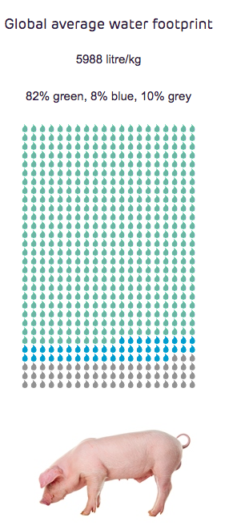

+ **@zagatti_trip_2018** have an empirical study 

## OVERARCHING IDEA 
News headlines often feature stories of water scarcity challenges and increasing competition for water. 
The Economist says _"The fundamental problems, however, are neither the resource itself, since water is likely to remain abundant enough even for a more populous Earth, nor technical. **They are managerial**, or, more precisely, how to withstand economic, cultural and political pressures to mismanage water."_ [See @economist_thirsty_2019, p.1]

Assuming that only what gets measured can be managed, the promise in many recent technological advances and emerging new approaches lies in that they enable to "SEE MORE" and therefore (possibly) "MANAGE BETTER". This can be argued at many different levels: 

+ See "more" of where 'fresh/raw'  water comes from 
+ See "more" of where water gets wasted at the community levels / along the distribution network
+ See "more" of our own individual footprint

## 1) Hard to "see" where water comes from (WRM perspective)
*Agriculture*, which uses 80% of all the water humans consume—could grow far more food with far less water with improved technologies and irrigation practices. _"However, a data gap exists about evapotranspiration (ET) - the largest user of water in many arid regions around the world- which, if fixed, would help us understand the amount of water available and used in irrigation and would help us to have more accurate water balances at the basin level."_ [See @rodriguez_into_2019]

### (Innovative) SOLUTIONs
--> satellite remote sensing data makes it possible to estimate evapotranspiration and bridge the data and data access gap.
	> In Mexico, satellite data is supporting a very large irrigation district to monitor crop types throughout the year and visualize evapotranspiration, enabling local stakeholders to see the field plots that evaporate more than others and target technical assistance to areas most in need. This prevents inefficiency with dwindling subsidies and limited government support. The national border agencies of Mexico are using this information to improve public spending and public support for farmers in this area. [See @rodriguez_into_2019]
	
	> One of the most transformative initiatives is OpenET, a collaborative effort between the Environmental Defense Fund, NASA, Google Earth Engine, and the Desert Research Institute, which aims to provide open and easily accessible ET data for improved water management. OpenET includes a set of web applications that leverage a mix of very different technologies (including cloud storage) that make low cost ET estimations more accessible to clients. [See @rodriguez_into_2019]
	
	
--> RS for Groundwater / Water footprint 
	> ????? 

#### Take water from new places 
_"Traditional investment planning, design, and operating models are linear in nature: water is extracted from the source, treated, and used, and the wastewater is then treated and discharged in a receiving water body. We need to transition from the linear model to a circular one focused on reducing water use and consumption and promoting the reuse, recycling, restoration, and recovery of water resources."_ [See @rodriguez_wastewater_2018] In LAC, less than 40% of the region’s wastewater is treated

--> Reuse (everyone drinks reused .... )

Singapore (NEwwater) but also Namibia Widhoek (1/4 of water is reused ??? )  
https://qz.com/is/what-happens-next-2/1438726/future-of-water/

--> Desalination

## 2) Hard to "see" where water gets lost (along the distribution network) 
In our **cities**, as much as a third of all water is lost to leaks or inefficient uses.

### Adjacent issue: inadequate price (regulation + suppliers') discourage saving

### (Innovative) SOLUTIONs

--> Local answer? (China sponge cities? )

--> RIght incentives ? 
2) Decisions at communty level (use of stormwater, local streams, ...  local weels )
3) city 
4) countries 

## 3) Hard to know what consumes more water (consumer perspective)
there is a *water “footprint” embedded in everything we do*: for irrigation, to grow cotton or produce steel, to make cell phones or cars, to water our gardens, and flush our toilets. 

_"The average American water footprint is 7,800 liters per day. Compare that with Germans who have a water footprint of 3,900 liters or the Chinese with 2,900 liters."_ [See @thakar_your_2018]

{width=25%}{width=25%}
{width=25%}{width=25%}

[see @hoekstra_water_2017]

1) Decisions at personal level (food, appliances, garden)
	"ew home appliances like washing machines, dishwashers, toilets, and showerheads use far less water now than they did a few years ago. The average toilet in the United States used to require over 20 liters per flush. Today, the national standard is six liters, and newer models use even less (and work even better)." (**@gleick_we_2018**)
	

# BIBLIOGRAPHY 